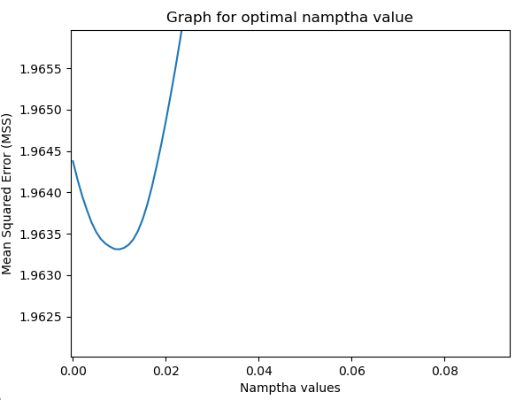
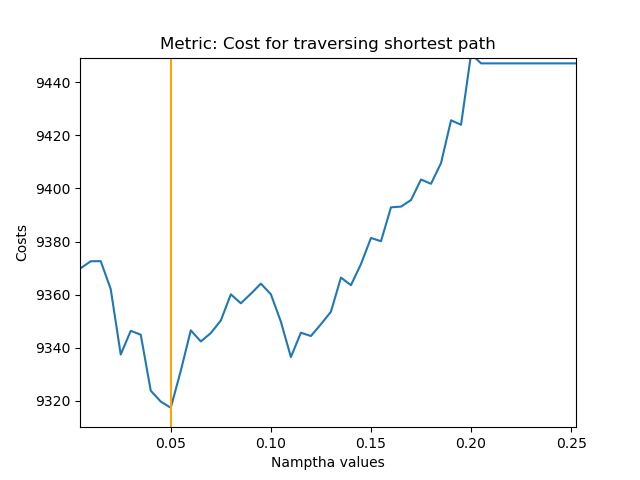

# Data-Driven-Decisions
A quantitative analysis on the performance of decision aware models.
## Background
The ubiquitous presence of ambiguity and unpredictability pervades every real world decision and thus the Decision Maker (DM) is confronted with an element of unpredictability, whether it be within the objective function that he seeks to maximize, or in some of the restrictions that he must adhere to. With the abundance of data now, many approaches are being formulated that seek to develop models that aid in achieving the most optimal solutions. One way to for model optimisation that diverge from main stream approaches is through contextually optimising models. This is where downstream data driven decisions come into play and where models become more "decision aware". 

This problem is futher illustrated in the paper "Data-Driven Conditional Robust Optimization" (refered below). In a standard cost minimization problem, where X ⊂ ℝ⁵ and cost(x,ξ). X captures the feasible set of actions and the cost, cost(x,ξ), that depends on both the action and a random permutation vector, ξ ( ξ ∈ $\mathbb{R}^m$). 

$\min_{x(\cdot)} \mathbb{E}[c(x(\psi), \xi)]$&nbsp;&nbsp;&nbsp;&nbsp;&nbsp;(1)
            
            
The standard approach to the cost minimization problem would be to predict then optimize. In general, machine learning tools are designed to minimize errors in prediction. How the predictions will be utilized in the optimization problem downstream is usually out of the equation. 

In contrast, this project explores the "Smart, Predict, then Optimize" framework that is introduced in the Management Science paper by  Adam N.Elmachtoub and Paul Grigas. This model directly utilizes the base framework of the optimization problem such as the problem's objective and constraints and produces a better prediction model.

In this project report, the perfomance of this approach in being quantitatively explored.  

[Experiment 1](#experiment1)
[Data generation](#data_generation)

This particular implementation of synthetic data generation is taken from the Elmachtoub-Grigas paper.
 
```python
def make_data(n, degree = 1,e = 0.5):
    b = bernoulli(0.5)
    d = 40 # total number of edges in a 5 by 5 matrix
    p = 5 # number of features
    # Construct a x feature vector
    I_p = np.identity(5)
    x = np.random.multivariate_normal(mean=np.array([0,0,0,0,0]),cov=I_p,size=(n))
    for i in range(n):
        for j in range(p):
            x[i][j] = abs(x[i][j])
    B = np.zeros(shape=(d,p))
    c = np.zeros(shape=(n,d))
    for i in range(d):
        for j in range(p):
            B[i][j] = b.rvs()
    
    # Construct a cost vector with dimension d
    for i in range(n):
        x_i = x[i].reshape(5,1)
        for j in range(d):
            noise = np.random.uniform(low=1-e,high=1+e)
            frac = 1/np.sqrt(p)
            vec_mult = (B @ x_i)[j]
            c[i][j] = (((frac*vec_mult + 3)**degree)+1)*noise
    return x,c
```

The vector x that represents features is in $\mathbb{R}^p$ while the cost vector, c, is in $\mathbb{R}^d$. In the function above, p and d are hardcoded to be 5 and 40 respectively. The dimension for the cost vector, d, correponds to the number of edges in a 5 by 5 matrix, other dimensions can be used for a n by m matrix using the following formula: Edges = n * (m-1) + m * (n-1). First, a random matrix $\mathbb{B}^* \subseteq \mathbb{R}^{d \times p}$ is generated which encodes the parameters of the true model, where each entry, b, in $\mathbb{B}^*$ is $b\sim\text{Bernoulli}(0.5)$. After the $\mathbb{B}^*$ matrix the training data is generated with n entries in total. Each entry has a feature vector x and a cost vector.

This function is used to generate both in-sample training data as well as out-of-sample test data.  

[Mean Squared Error Metric](#mss_metric)

The first section of experiment one focuses on the standard approach to machine learning models which is to "Predict then optimize". Data is generated and then split for training and testing purposes. A Lasso model is trained on the synthetic data and a namptha value is determined using Mean Square Error (MSE) as the metric. Basically finding the optimum namptha value ,$\lambda^*$, such that the Lasso model $\hat{\beta}^{lasso} = \underset{\beta}{argmin}\left\lbrace\frac{1}{2n}||\mathbf{y}-\mathbf{X}\beta||_2^2 + \lambda ||\beta||_1 \right\rbrace$ results in the lowest MSE. 

Code for obtaining the best model with MSE metric: 
```python
def get_best_model_alpha():
    x,c = make_data(1000)
    xtrain, xtest, ytrain, ytest = train_test_split(x,c,test_size=0.25,random_state=100)
    namptha_vals = np.arange(0.001,1,0.001)
    error_vals = []
    err_min = sys.maxsize
    best_model = None
    for alpha in namptha_vals:
        model = Lasso(alpha=alpha)
        model.fit(X=xtrain,y=ytrain)
        ypred = model.predict(X=xtest) #n/4, 5
        err = mean_squared_error(y_true=ytest,y_pred=ypred)
        if err < err_min:
            err_min = err
            best_model = model
        error_vals.append(err)
    return best_model, error_vals, namptha_vals
```



The minimum point on the graph above represents the optimal model with $\lambda^*$ as its parameter. 

[Downstream decision](#downstream_decision_exp1)

For this experiment we will be looking at the shortest path as a potential downstream decision, more explictly the cost associated to the shortest path, given a $5\times 5$ matrix with 40 edges. Each $i^\text{th}$ entry, c[i], in the cost vector will represent the cost associated to traversing that edge. 

This is where there is a change in the metric for assessing models. Initially the MSE was used to obtain $\lambda^*$, now the metric would be the cost associated with traversing the shortest path in a $5\times 5$ matrix.

```python
def downwards_optimisation(X,y,ML_MODEL):
    # take in x_train to train n models 
    # use x_test, y_test to get beta_namptha values
    # use those beta namptha values to generate predictions
    # use predictions to make paths and then calculate cost associated with the shortest path
    # use the cost to get namptha value that generates the lowest cost 
    x_train, x_test, y_train, y_test = train_test_split(X,y,test_size=0.25,random_state=100)
    namptha_vals = np.arange(0.005,0.5,0.005)
    best_model = None
    min_cost = sys.maxsize
    costs_arr = []
    for alpha in namptha_vals:
        model = ML_MODEL(alpha=alpha)
        model.fit(x_train,y_train)
        y_pred = model.predict(x_test) # 2D vector with shape (0.25*n,40)
        actual_cost = 0 # for a particular alpha val what is the predicted cost 
        for idx in range(len(y_pred)): # for every 40 dimensional vector
            predictedVec = np.array(y_pred[idx]).reshape(40,1)
            g = makeGraph(predictedVec)
            shortestPredictedPath = np.array(makeBinaryVector(getShortestPath(g))).reshape(40,1)
            # calculate actual cost * shortest predicted path
            actual_cost += y_test[idx]@shortestPredictedPath
        if actual_cost < min_cost:
            min_cost = actual_cost
            best_model = model
        costs_arr.append(actual_cost)
    return best_model
```

The $\textit{makeGraph}$ function converts the 40 dimensional matrix into a graph where the edges c[0], c[1], c[2] ... c[39] are edges connecting the 25 vertices. The $\textit{getShortestPath}$ function utilises Dijkstra's algorithm to find the shortest path in the graph which the $\textit{makeBinaryVector}$ function uses to create a vector with 0s and 1s representing which edge is traversed in the shortest path. Finally, to calculate cost the cost vector and the binary vector are multiplied together. 




[Performance comparison for Experiment 1](#Performance_exp1)

A 1000 entries for out of sample data is generated using the method described above. This data is then ran through the two optimised models, MSE optimized and Cost optimized, which the MSE and Cost metrics for optimization respectively. What we're interested in is the downstream issue of cost hence the model that is able to minimize cost would be considered to be the better model. 

```python
def MSE_Performance_Check(data,ML_MODEL,doPrint=False):
    is_x,is_c = data['in_sample_x'],data['in_sample_y']
    ofs_x, ofs_c = data['out_sample_x'], data['out_sample_y']
    # optimize using Mean squared Error as metric to get MSE optimized model
    mss_best_model = get_best_model_alpha(c=is_c,x=is_x,ML_MODEL=ML_MODEL)
    actual_costs = true_costs = differences = [] # initialse vectors used for graphing later
    for idx in range(len(ofs_x)):
        x_vec = np.array(ofs_x[idx]).reshape(5,1)
        cost_vec = np.array(ofs_c[idx]).reshape(1,40)
        beta = mss_best_model.coef_
        y_pred = np.dot(beta,x_vec) # predicted vector using MSS optimized model

        path = get_shortest_path(make_graph(y_pred))
        binaryVec = np.array(makeBinaryVector(path)).reshape(40,1)
        actualCost = cost_vec@binaryVec # calculated cost using MSE Optimized Model

        optimal_path = get_shortest_path(make_graph(cost_vec.reshape(40,1))) # true optimum cost using vector from out of sample data
        optimal_binary_path = makeBinaryVector(optimal_path)
        true_cost = cost_vec@np.array(optimal_binary_path).reshape(40,1) # actual optimal cost (actual_cost*optimalPath)
        if actualCost < true_cost: # This shouldn't be happening
            return Exception(f"Actual cost lower than optimal cost using MSE: AC {actual_cost}, OC: {true_cost}")
        # populate perfomance gauging vectors
        actual_costs.append(float(actualCost))
        true_costs.append(float(true_cost))
        differences.append(abs(actualCost-true_cost))
    actual_costs, differences = np.array(actual_costs), np.array(differences)
    if doPrint: # print out the different metrics to gauge performance
        print("Metric: Mean Squared Error")
        print(f"Mean actual_pred_cost stage 1: {round(np.mean(actual_costs),2)}")
        print(f"Mean standard deviation 1: {round(np.std(actual_costs),2)}")
        print(f"Median stage 1: {round(np.median(actual_costs),2)}")
        print(f"Mean difference stage 1: {round(np.mean(differences),2)}")   
    return actual_costs
```

The code above utilises in-sample data to train and retrieve a MSE optimized model. The main for loop iterated through all out of sample feature vectors and produces a $\textit{ypred}$ predicted vector, which in return is used to produce a predicted shortest path subsequently leading to cost being calculated and saved in the $\textit{actualCost}$ variable. Apart from the mean actualCost other performance metrics are also calculated such as the difference between the actualCost and the true optimum cost and the median actualCost. There is also an if condition in the for loop that checks whether actualCost < true_cost, this condition should never be true as the true_cost should be the minimum possible cost for any cost vector.

Now we run the out of sample data on a Cost Optimized model using a similar approach:

```python
def Cost_Performance_Check(data,ML_MODEL,doPrint=False):
    X,y = data['in_sample_x'],data['in_sample_y']
    ofs_x, ofs_c = data['out_sample_x'], data['out_sample_y']
    # optimize model using ACPP cost as the metric
    best_model = downwards_optimisation(X,y,ML_MODEL)
    beta = best_model.coef_
    costs = []
    optimal_cost = []
    differences = []
    for idx in range(len(ofs_x)):
        actual_cost = np.array(ofs_c[idx]).reshape(1,40)
        x_vec = np.array(ofs_x[idx]).reshape(5,1)
        y_pred = np.dot(beta,x_vec)

        predicted_path = get_shortest_path(make_graph(y_pred))
        binary_path = np.array(makeBinaryVector(predicted_path)).reshape(40,1)

        optimal_path = get_shortest_path(make_graph(actual_cost.reshape(40,1)))
        optimal_binary_path = np.array(makeBinaryVector(optimal_path)).reshape(40,1)

        actualCost = float(actual_cost@binary_path)
        optimalCost = float(actual_cost@optimal_binary_path)
        if actualCost < optimalCost:
            print(f"Error in step 2!")
            return Exception(f"Actual Cost lower than optimised cost using ACPP: AC {actualCost} , OC {optimalCost}")
        costs.append(actualCost)
        optimal_cost.append(optimalCost)
        differences.append(actualCost-optimalCost)
    if doPrint:
        print("Metric: AC*PP - AC*OP")
        print(f"Mean actual_pred_cost stage 2: {round(np.mean(costs),2)}")
        print(f"Mean standard deviation stage 2: {round(np.std(costs),2)}")
        print(f"Median stage 2: {round(np.median(costs),2)}")
        print(f"Mean difference stage 2: {round(np.mean(differences),2)}") 
    return costs
```

Data is generated using 3 parameters n,d and e where n is the number of entries, d is the degree of the data (1 for linear models) and e is the noice introduced. 

[References](#References)

[Adam N. Elmachtoub, Paul Grigas (2021) Smart “Predict, then Optimize”. Management Science](https://doi.org/10.1287/mnsc.2020.3922)
[Data-Driven Conditional Robust Optimization](https://proceedings.neurips.cc/paper_files/paper/2022/file/3df874367ce2c43891aab1ab23ae6959-Paper-Conference.pdf)
